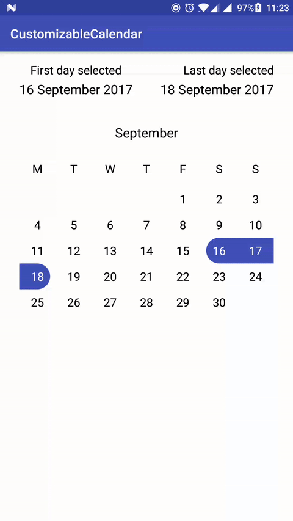
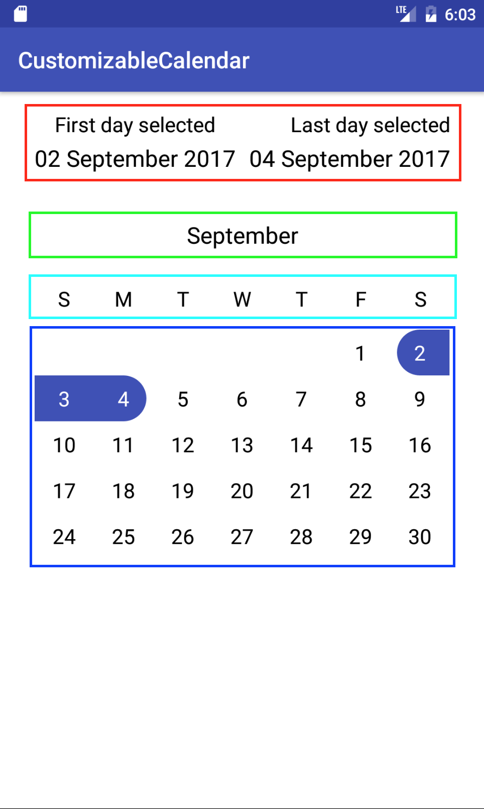

<p align="center">
  
</p>


# CustomizableCalendar

This library allows you to create a completely customizable calendar.
<br> You can use `CustomizableCalendar` to create your calendar, customizing UI and behaviour.

<p align="center">
  
</p>

# Features

* Custom header (should be implemented by the user);
* Custom sub view (month name by default);
* Custom weekly days view;
* Custom date view;
* Possibility to implement selection on day click;
* Possibility to implement weekly day calculation;
* Receive updates of Calendar (with AUCalendar);
* Every change to AUCalendar is notified and automatically refreshes UI;

# Limitations

* Only portrait orientation is supported

# Gradle
```gradle
allprojects {
  repositories {
    ...
    maven { url "https://jitpack.io" }
  }
}
```

```gradle
dependencies {
  compile 'com.github.MOLO17:CustomizableCalendar:v0.1.4'
}
```

# Dependencies

* RecyclerView
* [Joda-Time](https://github.com/JodaOrg/joda-time)
* [RxJava2](https://github.com/ReactiveX/RxJava)
* ~[ButterKnife](https://github.com/JakeWharton/butterknife)~ used on version <= 0.1.3
* ~[Retrolambda](https://github.com/orfjackal/retrolambda)~ used on version <= 0.1.3

# Usage

## Add to your layout

### XML

Add CustomizableCalendar to your layout

```xml
<com.molo17.customizablecalendar.library.components.CustomizableCalendar
        android:id="@+id/customizable_calendar"
        android:layout_width="match_parent"
        android:layout_height="wrap_content" />
```

### Java

First of all you should create a class that implements `ViewInteractor` interface (you can find the explanation in the `How to customize > Java` section).

After that go in the Activity/Fragment where you added the `CustomizableCalendar` View;
here you should specify the first month and the last month, to do this, create a `Calendar` (located in `com.molo17.customizablecalendar.library.model`) object.

An example of `CustomizableCalendar` init is the following:
```java
...

@BindView(R.id.customizable_calendar)
CustomizableCalendar customizableCalendar;

private CompositeDisposable subscriptions;

...

@Override
protected void onCreate(Bundle savedInstanceState) {
  super.onCreate(savedInstanceState);
  setContentView(R.layout.activity_main);
  ButterKnife.bind(this);

  DateTime today = new DateTime();

  // setting up first and last month that must be showed in the calendar
  DateTime firstMonth = today.withDayOfMonth(1);
  DateTime lastMonth = today.plusMonths(3).withDayOfMonth(1);

  // create the Calendar obj and setting it up with some configs like:
  // - first selected day
  // - last selected day
  // - multiple selection

  final Calendar calendar = new Calendar(firstMonth, lastMonth);
  calendar.setFirstSelectedDay(today.plusDays(4));

  // if you don't want the multiple selection mode just skip the 2 lines below
  calendar.setLastSelectedDay(today.plusDays(6));
  calendar.setMultipleSelection(true);

  // create a ViewInteractor obj needed to interact with the CustomizableCalendar
  final YourViewInteractorClass calendarViewInteractor = new YourViewInteractorClass();

  // create an AUCalendar object (a Calendar wrapper that operates as a singleton and provides all the updates)
  AUCalendar auCalendar = AUCalendar.getInstance(calendar);

  // this is needed to receives all Calendar updates (using RxJava 2)
  subscriptions.add(
    auCalendar.observeChangesOnCalendar().subscribe(new Consumer<AUCalendar.ChangeSet>() {
      @Override
      public void accept(AUCalendar.ChangeSet changeSet) throws Exception {
          // with ChangeSet you can be aware of which Calendar fields are changed
          // you can use changeSet.isFieldChanged(...) passing the name of the field;
          // name of the fields can be retrieved using CalendarFields interface;
          // AUCalendar is already updated because it's a singleton,
          // so for retrieving the updated data you can just use AUCalendar getters
      }
    })
  );

  // injecting the ViewInteractor to the CustomizableCalendar View
  customizableCalendar.injectViewInteractor(calendarViewInteractor)
}

@Override
protected void onDestroy() {
    super.onDestroy();
    subscriptions.clear();
}

...
```

## How to customize

### XML

If you want to customize the components you should create a separeted layout and add the reference to the `customizable_calendar` View with the tag `app:layout="@layout/your_layout"`

An example of a custom layout is the following:

```xml
<?xml version="1.0" encoding="utf-8"?>
<LinearLayout xmlns:android="http://schemas.android.com/apk/res/android"
    android:layout_width="match_parent"
    android:layout_height="match_parent"
    android:layout_marginEnd="30dp"
    android:layout_marginStart="30dp"
    android:orientation="vertical">

    <com.molo17.customizablecalendar.library.components.HeaderView
        android:id="@android:id/primary"
        android:layout_width="match_parent"
        android:layout_height="wrap_content" />

    <com.molo17.customizablecalendar.library.components.SubView
        android:id="@android:id/text2"
        android:layout_width="match_parent"
        android:layout_height="wrap_content"
        android:layout_marginTop="30dp" />

    <com.molo17.customizablecalendar.library.components.WeekDaysView
        android:id="@android:id/text1"
        android:layout_width="match_parent"
        android:layout_height="wrap_content"
        android:layout_gravity="center_horizontal"
        android:layout_marginTop="30dp" />

    <com.molo17.customizablecalendar.library.components.CalendarRecyclerView
        android:id="@android:id/content"
        android:layout_width="match_parent"
        android:layout_height="@dimen/customizable_calendar_height"
        android:layout_marginTop="15dp" />

</LinearLayout>
```
**NOTE** that ids must not be different from the ones above, so:
* `@android:id/primary` for **HeaderView**;
* `@android:id/text1` for **WeekDaysView**;
* `@android:id/text2` for **SubView**;
* `@android:id/content` for **CalendarRecyclerView**;

<p align="center">
  
</p>

#### HeaderView

First (red) rectangle of the screenshot above.
<br> It's a `RelativeLayout`, you should create your own layout.

#### WeekDaysView

Third (light blue) rectangle of the screenshot above.
<br> It's a `RecyclerView`, the ViewHolder item is already implemented.
<br> You can create your own ViewHolder layout using a `RelativeLayout` with a `TextView` that has `@android:id/summary` as id.

#### SubView

Second (green) rectangle of the screenshot above.
<br> It's a `RelativeLayout`, implemented by default with the name of the month centered.
<br> If you want to create your own layout make sure to have a `TextView` with id `@android:id/summary`.

#### CalendarRecyclerView

Fourth (blue) rectangle of the screenshot above.
<br> It's a `RelativeLayout`, implemented by default with a `LinearLayout` (with a `GridLayout` inside) for the month and a `RelativeLayout` for the day.
<br> If you want to create your own month layout you can specify `app:month_layout="@layout/your_layout"` for the month and `app:cell_layout="@layout/your_layout"` for the day.
<br> Make sure to use `@android:id/widget_frame` as id for the `GridView` and `@android:id/background`, `@android:id/startSelectingText`, `@android:id/stopSelectingText`, `@android:id/title` respectively for single selection background, first day selection background (in multiple selection mode), last day selection background (in multiple selection mode) and the `TextView` where the day is displayed.

### Java

All code customization can be applied using the `ViewInteractor`.

Here are listed all of the methods with a small description:
* `void onCustomizableCalendarBindView(View view)`
<br> Here you can customize the `CustomizableCalendar` View.
<br> This method is called after `customizableCalendar.injectViewInteractor(...)`.

* `void onHeaderBindView(ViewGroup view)`
<br> Here you can customize the `HeaderView` View, inflating your layout etc...
<br> This method is called after `headerView.injectViewInteractor(...)`.

* `void onWeekDaysBindView(View view)`
<br> Here you can customize the `WeekDays` View.
<br> This method is called after `weekDays.injectViewInteractor(...)`.

* `void onWeekDayBindView(WeekDaysViewAdapter.WeekDayVH holder, String weekDay)`
<br> Here you can customize the `WeekDayVH` ViewHolder.
<br> This method is called after `onBindViewHolder` of `WeekDaysViewAdapter`.

* `void onSubViewBindView(View view, String month)`
<br> Here you can customize the `SubView` View.
<br> This method is called after `onMonthChanged`.

* `void onCalendarBindView(View view)`
<br> Here you can customize the `CalendarRecyclerView` View.
<br> This method is called after `calendarRecyclerView.injectViewInteractor(...)`.

* `void onMonthBindView(View view)`
<br> Here you can customize the `MonthGridView` View.
<br> This method is called after `onCreateViewHolder` of `CalendarViewAdapter`.

* `View onMonthCellBindView(View view, CalendarItem currentItem)`
<br> Here you can customize the `GridViewCell` View.
<br> This method is called in the `getView` of `MonthAdapter`, you must return the customized view.

* `boolean hasImplementedMonthCellBinding()`
<br> Here you should return `true` if you have implemented the above method (`onMonthCellBindView`).
<br> This method is called in the `getView` method of `MonthAdapter`.

* `List<CalendarItem> calculateDays(int year, int month, int firstDayOfMonth, int lastDayOfMonth)`
<br> Here you can calculate the days of the month (if you want for example to include `Saturday` and `Sunday`)
<br> This method is called in the `getView` of `MonthAdapter`.

* `boolean hasImplementedDayCalculation()`
<br> Here you should return `true` if you have implemented the above method (`calculateDays`).
<br> This method is called in the `refreshDays` method of `MonthAdapter`.

* `int setSelected(boolean multipleSelection, DateTime dateSelected)`
<br> Here you can calculate the selection of the day.
<br> This method is called in the `setSelected` method of `MonthAdapter`.
<br> You must return 0, 1 or -1 respectively for `first selection`, `last selection` and `no selection`.

* `boolean hasImplementedSelection()`
<br> Here you should return `true` if you have implemented the above method (`setSelected`).
<br> This method is called in the `setSelected` method of `MonthAdapter`.

* `String formatWeekDayName(String nameOfDay);`
<br> Here you can format the name of the week day.
<br> This method is called after `injectViewInteractor` method of `WeekDaysView`.
<br> You should return the formatted name of the week day.

* `boolean hasImplementedWeekDayNameFormat()`
<br> Here you should return `true` if you have implemented the above method (`formatWeekDayName`).
<br> This method is called after `injectViewInteractor` method of `WeekDaysView`.

* `View getMonthGridView(View rootView)`
<br> Here you can create your customized `MonthGridView`.
<br> You should return a `MonthGridView`.
<br> This method is called in the `onCreateViewHolder` method of `CalendarViewAdapter`.

Getting Help
------------
To report a specific problem or feature request, [open a new issue here on Github](https://github.com/MOLO17/CustomizableCalendar/issues/new). For questions, suggestions, or anything else, email us at sales@molo17.com.
